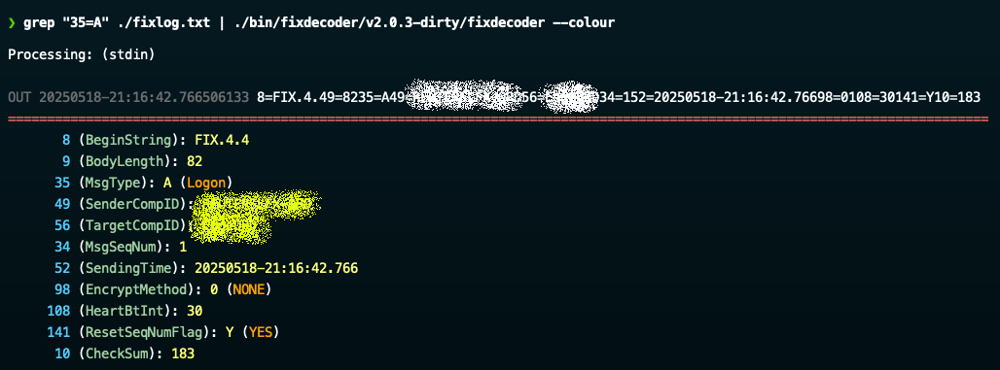
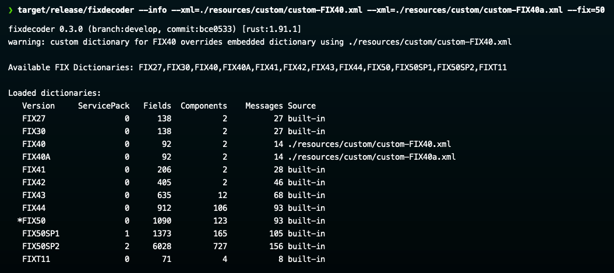
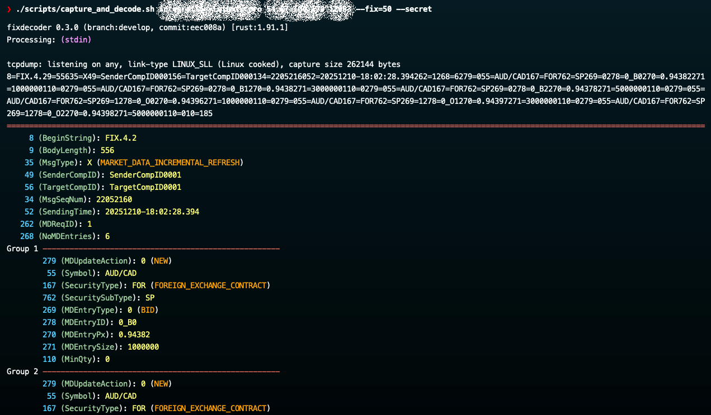

---

[](https://sonarcloud.io/summary/new_code?id=stephenlclarke_fixdecoder2)
[](https://sonarcloud.io/summary/new_code?id=stephenlclarke_fixdecoder2)
[](https://sonarcloud.io/summary/new_code?id=stephenlclarke_fixdecoder2)
[](https://sonarcloud.io/summary/new_code?id=stephenlclarke_fixdecoder2)
[](https://sonarcloud.io/summary/new_code?id=stephenlclarke_fixdecoder2)
[](https://sonarcloud.io/summary/new_code?id=stephenlclarke_fixdecoder2)
[](https://sonarcloud.io/summary/new_code?id=stephenlclarke_fixdecoder2)
[](https://sonarcloud.io/summary/new_code?id=stephenlclarke_fixdecoder2)
[](https://sonarcloud.io/summary/new_code?id=stephenlclarke_fixdecoder2)
[](https://sonarcloud.io/summary/new_code?id=stephenlclarke_fixdecoder2)
[](https://sonarcloud.io/summary/new_code?id=stephenlclarke_fixdecoder2)


---

# Steve's FIX Decoder / logfile prettify utility

This is my attempt to create an "all-singing / all-dancing" utility to pretty-print logfiles containing FIX Protocol messages while simultaneously learning **Rust** (after first building an earlier version in Go) and trying to incorporate SonarQube Code Quality metrics.

I have written utilities like this in past in Java, Python, C, C++, [go](https://github.com/stephenlclarke/fixdecoder) and even in Bash/Awk!! This is my favourite one so far — and now it is fully native Rust.



---

<p align="center">
  <a href="https://buy.stripe.com/8x23cvaHjaXzdg30Ni77O00">
    
  </a>
  &nbsp;
  <a href="https://github.com/stephenlclarke/fixdecoder/discussions">
    
  </a>
</p>

<p align="center">
  <sub>☕ If you found this project useful, consider buying me a coffee or dropping a comment — it keeps the caffeine and ideas flowing! 😄</sub>
</p>

---

## What is it

fixdecoder is a FIX-aware “tail-like” tool and dictionary explorer. It reads from stdin or multiple log files, detects and prettifies FIX messages in stream, and fits naturally into pipelines. Each highlighted message is followed by a detailed tag breakdown using the correct dictionary for BeginString (8) (or DefaultApplVerID (1137) when 8=FIXT.1.1). It can validate on the fly (`--validate`), reporting protocol issues as it decodes, and track order state with summaries (`--summary`). For lookups, `--info` shows available/overridden dictionaries, and `--message`, `--component`, or `--tag` inspect definitions in the selected FIX version (`--fix` or default) without a live decode.

## Quick start

```bash
# Stream and prettify stdin (pipeline-friendly)
cat fixlog.txt | fixdecoder

# Stream with validation + order summaries
cat fixlog.txt | fixdecoder --validate --summary
```
<!-- Screenshot: cat fixlog.txt | fixdecoder -->
<!-- Screenshot: cat fixlog.txt | fixdecoder --validate --summary -->

## Running the fixdecoder utility

You can run fixdecoder anywhere you can run a Rust binary — no extra OS dependencies or runtime services are required. It ships with a full set of embedded FIX dictionaries. The sections below cover the key options for selecting and browsing dictionaries, controlling output/formatting, and adjusting processing modes.

## Key options at a glance

- Dictionaries: `--xml`, `--fix`, `--info`, `--message`, `--component`, `--tag`
- Output/layout: `--column`, `--verbose`, `--header`, `--trailer`, `--colour`, `--delimiter`
- Processing modes: `--follow`, `--validate`, `--secret`, `--summary`

### `--xml`

The `--xml` flag lets you load custom FIX dictionaries from XML files; you can pass it multiple times to register several custom dictionaries. Each file is parsed, normalised to a canonical key (e.g., FIX44, FIX50SP2), and has FIXT11 session header/trailer injected for 5.0+ if missing. Custom entries are registered for tag lookup and schema loading; they override built-ins for the same key and replace earlier `--xml` files for that key, with warnings emitted in both cases.

The XML dictionaries can be downloaded from the [QuickFIX GitHub Repo](https://github.com/quickfix/quickfix/tree/master/spec)

### `--fix`

The `--fix` option allows you to specify the default FIX dictionary. This defaults to FIX 4.4 (`44`). It accepts either just the version digits (e.g., `44`, `4.4`) or the same value prefixed with FIX/fix (e.g., `FIX44`, `fix4.4`). The parser normalises your input by stripping dots, uppercasing, and adding FIX if it’s missing; it then checks that key against built‑ins (`FIX27`…`FIXT11`) and any custom `--xml` overrides. If the normalised key isn’t known, it errors.

### `--info`

`--info` is an informational mode: it prints the list of available FIX dictionary keys (built-ins plus any loaded via `--xml`), then a table of loaded dictionaries with counts and their source (built-in vs file path). The table highlights the currently selected/default FIX version (from `--fix` or the default `44`) with a leading `*` so you can see which dictionary will be used. It does not decode messages or print schema details; it’s meant to verify which dictionaries are present, which ones are being overridden by custom XML, and which version is active.



## Querying the FIX dictionaries `--message`, `--component` and `--tag`

Use these flags to explore the active FIX dictionary. `--verbose` adds detail / metadata, `--column` uses a compact table layout. `--header`/`--trailer` only apply to `--message` and `--component` (not `--tag`).

### `--message[=<NAME|MsgType>]`

Browse messages. With no value, list all message types (use --`column` for a compact view). With a name or MsgType (e.g., `D` or `NewOrderSingle`), render the message structure (fields, components, repeating groups); `--header`/`--trailer` include session blocks. Reports “Message not found” if absent.

### `--component[=<NAME>]`

Browse components. With no value, list all components (or use `--column`). With a name, render that component’s fields, nested components, and repeating groups. Reports “Component not found” if absent.

### `--tag[=<NUMBER>]`

Browse fields. With no value, list all tags (or use `--column`). With a tag number, show that field’s details (name, type, enums, etc.). Reports “Tag not found” if absent.

### `--validate`

Validate each decoded FIX message against the active dictionary (honours `--fix` and any `--xml` overrides). Checks MsgType, BodyLength, checksum, required fields, enum/type correctness, field ordering, repeating-group structure, and duplicate disallowed tags. Validation runs alongside prettified output; any errors are appended after the message. It doesn’t stop the stream—use it to flag protocol issues while decoding

### `--secret`

Obfuscate sensitive FIX fields while decoding. When enabled, values for a predefined set of sensitive tags (e.g., session IDs, sender/target IDs) are replaced with stable aliases (e.g., `SenderCompID0001`) so logs stay readable without exposing real identifiers. Obfuscation is applied per line/message and resets between files; disabled by default.

### `--colour[=yes|no]`

Control coloured output. By default, colours are shown when writing to a terminal and disabled when output is piped. Use `--colour`/`--colour=yes` to force colours on, or `--colour=no` to force them off. Non-tty output defaults to no colour unless you explicitly opt in.

### `--delimiter=<CHAR>`

Set the display delimiter between FIX fields (default: `SOH`). Specify a single character after `=` sign.

Accepted values:

- A single literal character (e.g.`,`, `|`, or a single Unicode character like `—`).
  
- SOH (case-insensitive) or a hex escape like `\x01`/`0x01` (quote to protect the backslash, e.g. `--delimiter='\x1f'`).

Empty values or anything longer than one character are rejected.

### `-f`, `--follow`

Stream input like `tail -f`. Keeps reading and decoding as new data arrives on stdin or a file, sleeping briefly on `EOF` rather than exiting, until interrupted. This mirrors `tail -f` behaviour but with FIX decoding, validation, and prettification applied in real time.

### `--summary`

Track FIX order lifecycles and emit a summary instead of full decoded messages. When enabled, each message is consumed into an order tracker (keyed by `OrderID`/`ClOrdID`/`OrigClOrdID`), updating state, quantities, prices, and events. At the end (or live in `--follow` mode) it prints a concise per-order summary/footer using the chosen display delimiter. This mode suppresses the usual prettified message output; use it to monitor order state across a stream or log.

# Download it

Check out the Repo's [Releases Page](https://github.com/stephenlclarke/fixdecoder2/releases) to see what versions are available for the computer you want to run it on.

# Build it

Build it from source. This now requires `bash` version 5+ and a recent `Rust` toolchain (the project is tested with Rust 1.91+).

```bash
❯ bash --version
GNU bash, version 5.3.3(1)-release (aarch64-apple-darwin24.4.0)
Copyright (C) 2025 Free Software Foundation, Inc.
License GPLv3+: GNU GPL version 3 or later <http://gnu.org/licenses/gpl.html>

This is free software; you are free to change and redistribute it.
There is NO WARRANTY, to the extent permitted by law.

❯ rustc --version
rustc 1.78.0 (9b00956e5 2024-04-29)
```

Clone the git repo.

```bash
❯ git clone git@github.com:stephenlclarke/fixdecoder.git
Cloning into 'fixdecoder'...
remote: Enumerating objects: 418, done.
remote: Counting objects: 100% (418/418), done.
remote: Compressing objects: 100% (375/375), done.
remote: Total 418 (delta 201), reused 0 (delta 0), pack-reused 0 (from 0)
Receiving objects: 100% (418/418), 1.02 MiB | 2.65 MiB/s, done.
Resolving deltas: 100% (201/201), done.
❯ cd fixdecoder
```

Then build it. Debug version with clippy and code coverage

```bash
❯ make clean build scan coverage build-release
     Removed 51032 files, 3.9GiB total

>> Ensuring Rust toolchain and coverage tools

>> Installing llvm-tools-preview component
info: component 'llvm-tools' for target 'aarch64-apple-darwin' is up to date

>> Ensuring FIX XML specs are present
   Compiling minimal-lexical v0.2.1
   Compiling thiserror v1.0.69
   Compiling fixdecoder v0.3.0 (/Users/sclarke/github/fixdecoder2)
   Compiling thiserror-impl v1.0.69
   Compiling arrayvec v0.7.6
   Compiling circular v0.3.0
   Compiling etherparse v0.15.0
   Compiling nom v7.1.3
warning: fixdecoder@0.3.0: Building fixdecoder 0.3.0 (branch:develop, commit:9f467f8) [rust:1.91.1]
   Compiling rusticata-macros v4.1.0
   Compiling pcap-parser v0.14.1
   Compiling pcap2fix v0.1.0 (/Users/sclarke/github/fixdecoder2/pcap2fix)
    Finished `dev` profile [unoptimized + debuginfo] target(s) in 1.88s
    Checking memchr v2.7.6
    Checking anstyle v1.0.13
    Checking utf8parse v0.2.2
    Checking bitflags v2.10.0
    Checking regex-syntax v0.8.8
    Checking libc v0.2.178
    Checking anstyle-query v1.1.5
    Checking is_terminal_polyfill v1.70.2
    Checking colorchoice v1.0.4
    Checking crossbeam-utils v0.8.21
    Checking num-traits v0.2.19
    Checking strsim v0.11.1
    Checking anstyle-parse v0.2.7
    Checking cfg-if v1.0.4
   Compiling rustix v1.1.2
    Checking objc2-encode v4.1.0
    Checking clap_lex v0.7.6
    Checking serde_core v1.0.228
    Checking anyhow v1.0.100
    Checking predicates-core v1.0.9
    Checking core-foundation-sys v0.8.7
    Checking objc2 v0.6.3
    Checking anstream v0.6.21
   Compiling fixdecoder v0.3.0 (/Users/sclarke/github/fixdecoder2)
    Checking crossbeam-epoch v0.9.18
    Checking aho-corasick v1.1.4
    Checking normalize-line-endings v0.3.0
    Checking clap_builder v4.5.53
    Checking iana-time-zone v0.1.64
    Checking crossbeam-deque v0.8.6
    Checking either v1.15.0
    Checking termtree v0.5.1
    Checking float-cmp v0.10.0
    Checking difflib v0.4.0
    Checking rayon-core v1.13.0
    Checking once_cell v1.21.3
   Compiling assert_cmd v2.1.1
   Compiling getrandom v0.3.4
    Checking predicates-tree v1.0.12
    Checking chrono v0.4.42
    Checking rayon v1.11.0
    Checking errno v0.3.14
    Checking nix v0.30.1
    Checking wait-timeout v0.2.1
    Checking roxmltree v0.21.1
    Checking block2 v0.6.2
warning: fixdecoder@0.3.0: Building fixdecoder 0.3.0 (branch:develop, commit:9f467f8) [rust:1.91.1]
    Checking minimal-lexical v0.2.1
    Checking fastrand v2.3.0
    Checking arrayvec v0.7.6
    Checking dispatch2 v0.3.0
    Checking nom v7.1.3
    Checking circular v0.3.0
    Checking etherparse v0.15.0
    Checking regex-automata v0.4.13
    Checking thiserror v1.0.69
    Checking clap v4.5.53
    Checking ctrlc v3.5.1
    Checking serde v1.0.228
    Checking terminal_size v0.4.3
    Checking quick-xml v0.36.2
    Checking tempfile v3.23.0
    Checking rusticata-macros v4.1.0
    Checking pcap-parser v0.14.1
    Checking pcap2fix v0.1.0 (/Users/sclarke/github/fixdecoder2/pcap2fix)
    Checking regex v1.12.2
    Checking bstr v1.12.1
    Checking predicates v3.1.3
    Finished `dev` profile [unoptimized + debuginfo] target(s) in 3.30s
Running cargo-audit (text output)
      Loaded 884 security advisories (from /Users/sclarke/.cargo/advisory-db)
    Scanning Cargo.lock for vulnerabilities (115 crate dependencies)
Running cargo-audit (JSON) → target/coverage/rustsec.json
Converting RustSec report to Sonar generic issues (target/coverage/sonar-generic-issues.json)
info: cargo-llvm-cov currently setting cfg(coverage); you can opt-out it by passing --no-cfg-coverage
   Compiling libc v0.2.178
   Compiling memchr v2.7.6
   Compiling proc-macro2 v1.0.103
   Compiling quote v1.0.42
   Compiling unicode-ident v1.0.22
   Compiling autocfg v1.5.0
   Compiling regex-syntax v0.8.8
   Compiling crossbeam-utils v0.8.21
   Compiling bitflags v2.10.0
   Compiling anstyle v1.0.13
   Compiling objc2 v0.6.3
   Compiling utf8parse v0.2.2
   Compiling anstyle-parse v0.2.7
   Compiling cfg-if v1.0.4
   Compiling colorchoice v1.0.4
   Compiling is_terminal_polyfill v1.70.2
   Compiling rustix v1.1.2
   Compiling cfg_aliases v0.2.1
   Compiling serde_core v1.0.228
   Compiling objc2-encode v4.1.0
   Compiling anstyle-query v1.1.5
   Compiling anstream v0.6.21
   Compiling num-traits v0.2.19
   Compiling aho-corasick v1.1.4
   Compiling nix v0.30.1
   Compiling rayon-core v1.13.0
   Compiling strsim v0.11.1
   Compiling anyhow v1.0.100
   Compiling crossbeam-epoch v0.9.18
   Compiling serde v1.0.228
   Compiling semver v1.0.27
   Compiling heck v0.5.0
   Compiling clap_lex v0.7.6
   Compiling clap_builder v4.5.53
   Compiling regex-automata v0.4.13
   Compiling block2 v0.6.2
   Compiling syn v2.0.111
   Compiling rustc_version v0.4.1
   Compiling crossbeam-deque v0.8.6
   Compiling core-foundation-sys v0.8.7
   Compiling predicates-core v1.0.9
   Compiling iana-time-zone v0.1.64
   Compiling errno v0.3.14
   Compiling regex v1.12.2
   Compiling dispatch2 v0.3.0
   Compiling fixdecoder v0.3.0 (/Users/sclarke/github/fixdecoder2)
   Compiling once_cell v1.21.3
   Compiling termtree v0.5.1
   Compiling difflib v0.4.0
   Compiling getrandom v0.3.4
   Compiling assert_cmd v2.1.1
   Compiling either v1.15.0
   Compiling float-cmp v0.10.0
   Compiling normalize-line-endings v0.3.0
   Compiling predicates v3.1.3
   Compiling terminal_size v0.4.3
   Compiling chrono v0.4.42
   Compiling predicates-tree v1.0.12
   Compiling bstr v1.12.1
   Compiling wait-timeout v0.2.1
   Compiling ctrlc v3.5.1
   Compiling roxmltree v0.21.1
   Compiling rayon v1.11.0
   Compiling fastrand v2.3.0
   Compiling minimal-lexical v0.2.1
   Compiling nom v7.1.3
   Compiling thiserror v1.0.69
   Compiling tempfile v3.23.0
   Compiling clap_derive v4.5.49
   Compiling serde_derive v1.0.228
   Compiling thiserror-impl v1.0.69
warning: fixdecoder@0.3.0: Building fixdecoder 0.3.0 (branch:develop, commit:9f467f8) [rust:1.91.1]
   Compiling circular v0.3.0
   Compiling arrayvec v0.7.6
   Compiling etherparse v0.15.0
   Compiling clap v4.5.53
   Compiling rusticata-macros v4.1.0
   Compiling pcap-parser v0.14.1
   Compiling pcap2fix v0.1.0 (/Users/sclarke/github/fixdecoder2/pcap2fix)
   Compiling quick-xml v0.36.2
    Finished `test` profile [unoptimized + debuginfo] target(s) in 8.38s
     Running unittests src/main.rs (target/llvm-cov-target/debug/deps/fixdecoder-ae50d2dc6f6148f6)

running 75 tests
test decoder::display::tests::layout_stats_produces_layout ... ok
test decoder::display::tests::pad_ansi_extends_to_requested_width ... ok
test decoder::display::tests::collect_group_layout_counts_nested_components ... ok
test decoder::display::tests::print_field_renders_required_indicator ... ok
test decoder::display::tests::compute_values_layout_uses_max_entry ... ok
test decoder::display::tests::print_enum_outputs_coloured_enum ... ok
test decoder::display::tests::tag_and_message_cells_include_expected_text ... ok
test decoder::display::tests::collect_sorted_values_orders_by_enum ... ok
test decoder::display::tests::terminal_width_is_positive ... ok
test decoder::display::tests::compute_message_layout_counts_header_and_trailer ... ok
test decoder::display::tests::visible_len_ignores_escape_sequences ... ok
test decoder::display::tests::visible_width_ignores_ansi_sequences ... ok
test decoder::display::tests::print_enum_columns_respects_layout_columns ... ok
test decoder::display::tests::write_with_padding_adds_spaces ... ok
test decoder::display::tests::render_component_prints_matching_msg_type_enum_only ... ok
test decoder::display::tests::render_message_includes_header_and_trailer ... ok
test decoder::display::tests::cached_layout_is_reused_for_component ... ok
test decoder::prettifier::tests::trim_line_endings_strips_crlf ... ok
test decoder::prettifier::tests::read_line_with_follow_returns_zero_on_eof ... ok
test decoder::schema::tests::parse_simple_vec ... ok
test decoder::schema::tests::parse_message_fields ... ok
test decoder::schema::tests::parse_message_with_components ... ok
test decoder::prettifier::tests::prettify_aligns_group_entries_without_header ... ok
test decoder::prettifier::tests::header_and_trailer_are_repositioned_when_out_of_place ... ok
test decoder::prettifier::tests::build_tag_order_respects_annotations_and_trailer ... ok
test decoder::summary::tests::build_summary_row_includes_bn_headers ... ok
test decoder::summary::tests::display_instrument_formats_side_and_symbol ... ok
test decoder::summary::tests::date_diff_days_returns_none_when_incomplete ... ok
test decoder::summary::tests::extract_date_part_handles_timestamp ... ok
test decoder::summary::tests::flow_label_skips_leading_unknown ... ok
test decoder::summary::tests::preferred_settlement_date_prefers_primary_then_secondary ... ok
test decoder::summary::tests::render_record_header_includes_id_and_instrument ... ok
test decoder::summary::tests::resolve_key_prefers_alias_then_ids ... ok
test decoder::summary::tests::state_path_deduplicates_consecutive_states ... ok
test decoder::summary::tests::terminal_status_from_non_exec_report_updates_header ... ok
test decoder::tag_lookup::tests::detects_schema_from_default_appl_ver_id ... ok
test decoder::summary::tests::absorb_fields_sets_core_values ... ok
test decoder::summary::tests::render_outputs_state_headline ... ok
test decoder::summary::tests::bn_message_sets_state_and_spot_price ... ok
test decoder::summary::tests::absorb_fields_sets_block_notice_specifics ... ok
test decoder::validator::tests::allows_repeating_group_tags ... ok
test decoder::validator::tests::detects_body_length_mismatch ... ok
test decoder::validator::tests::detects_checksum_mismatch ... ok
test decoder::validator::tests::missing_msg_type_still_reports_length_and_tag ... ok
test fix::obfuscator::tests::reset_starts_aliases_over ... ok
test tests::add_entity_arg_defaults_to_true_when_missing_value ... ok
test tests::add_flag_args_sets_flags ... ok
test tests::build_cli_parses_follow_and_summary_flags ... ok
test tests::dictionary_key_includes_service_pack ... ok
test tests::dictionary_marker_highlights_selected_entry ... ok
test tests::dictionary_source_prefers_custom_entry ... ok
test tests::final_exit_code_marks_interrupt ... ok
test tests::invalid_fix_version_errors ... ok
test tests::normalise_fix_key_handles_variants ... ok
test tests::parse_colour_recognises_yes_no ... ok
test tests::parse_colour_rejects_invalid ... ok
test decoder::summary::tests::links_orders_using_order_id_and_cl_ord_id ... ok
test tests::parse_delimiter_accepts_hex ... ok
test tests::parse_delimiter_accepts_literal ... ok
test tests::parse_delimiter_rejects_empty ... ok
test tests::resolve_input_files_defaults_to_stdin ... ok
test tests::resolve_input_files_preserves_inputs ... ok
test tests::valid_fix_version_passes ... ok
test tests::version_str_is_cached ... ok
test tests::version_string_matches_components ... ok
test decoder::prettifier::tests::prettify_includes_missing_tag_annotations_once ... ok
test decoder::prettifier::tests::prettify_orders_without_msg_type_header_first ... ok
test decoder::summary::tests::collects_states_for_single_order ... ok
test decoder::prettifier::tests::validation_inserts_missing_tags ... ok
test decoder::prettifier::tests::validation_only_outputs_invalid_messages ... ok
test decoder::prettifier::tests::validation_skips_valid_messages ... ok
test decoder::tag_lookup::tests::load_dictionary_respects_override_key ... ok
test decoder::tag_lookup::tests::override_uses_fallback_dictionary_for_missing_tags ... ok
test decoder::tag_lookup::tests::repeatable_tags_include_nested_groups ... ok
test decoder::tag_lookup::tests::warns_and_falls_back_on_unknown_override ... ok

test result: ok. 75 passed; 0 failed; 0 ignored; 0 measured; 0 filtered out; finished in 3.00s

     Running unittests src/bin/generate_sensitive_tags.rs (target/llvm-cov-target/debug/deps/generate_sensitive_tags-79d8bd38aa9fdc5a)

running 0 tests

test result: ok. 0 passed; 0 failed; 0 ignored; 0 measured; 0 filtered out; finished in 0.00s

     Running tests/cli.rs (target/llvm-cov-target/debug/deps/cli-762abd0244a0dac8)

running 5 tests
test summary_mode_outputs_order_summary ... ok
test decodes_single_message_from_stdin ... ok
test validation_reports_missing_fields ... ok
test decodes_message_from_file_path ... ok
test override_is_honoured_with_fallback ... ok

test result: ok. 5 passed; 0 failed; 0 ignored; 0 measured; 0 filtered out; finished in 3.24s

     Running unittests src/main.rs (target/llvm-cov-target/debug/deps/pcap2fix-19171fc4d58700e9)

running 6 tests
test tests::out_of_order_future_segment_is_skipped ... ok
test tests::flushes_full_messages_only ... ok
test tests::flush_complete_messages_emits_and_retains_tail ... ok
test tests::parse_delimiter_variants ... ok
test tests::reassembly_appends_in_order ... ok
test tests::retransmit_is_ignored ... ok

test result: ok. 6 passed; 0 failed; 0 ignored; 0 measured; 0 filtered out; finished in 0.00s


    Finished report saved to target/coverage/coverage.xml
   Compiling proc-macro2 v1.0.103
   Compiling quote v1.0.42
   Compiling unicode-ident v1.0.22
   Compiling memchr v2.7.6
   Compiling libc v0.2.178
   Compiling crossbeam-utils v0.8.21
   Compiling bitflags v2.10.0
   Compiling objc2 v0.6.3
   Compiling utf8parse v0.2.2
   Compiling colorchoice v1.0.4
   Compiling cfg_aliases v0.2.1
   Compiling is_terminal_polyfill v1.70.2
   Compiling anstyle-parse v0.2.7
   Compiling serde_core v1.0.228
   Compiling autocfg v1.5.0
   Compiling objc2-encode v4.1.0
   Compiling anstyle-query v1.1.5
   Compiling anstyle v1.0.13
   Compiling nix v0.30.1
   Compiling anstream v0.6.21
   Compiling semver v1.0.27
   Compiling num-traits v0.2.19
   Compiling clap_lex v0.7.6
   Compiling rustix v1.1.2
   Compiling serde v1.0.228
   Compiling anyhow v1.0.100
   Compiling strsim v0.11.1
   Compiling rayon-core v1.13.0
   Compiling heck v0.5.0
   Compiling clap_builder v4.5.53
   Compiling block2 v0.6.2
   Compiling crossbeam-epoch v0.9.18
   Compiling crossbeam-deque v0.8.6
   Compiling rustc_version v0.4.1
   Compiling syn v2.0.111
   Compiling aho-corasick v1.1.4
   Compiling minimal-lexical v0.2.1
   Compiling core-foundation-sys v0.8.7
   Compiling cfg-if v1.0.4
   Compiling regex-syntax v0.8.8
   Compiling errno v0.3.14
   Compiling dispatch2 v0.3.0
   Compiling iana-time-zone v0.1.64
   Compiling nom v7.1.3
   Compiling fixdecoder v0.3.0 (/Users/sclarke/github/fixdecoder2)
   Compiling thiserror v1.0.69
   Compiling either v1.15.0
   Compiling regex-automata v0.4.13
   Compiling rusticata-macros v4.1.0
   Compiling rayon v1.11.0
   Compiling terminal_size v0.4.3
   Compiling ctrlc v3.5.1
   Compiling roxmltree v0.21.1
   Compiling arrayvec v0.7.6
   Compiling serde_derive v1.0.228
   Compiling clap_derive v4.5.49
   Compiling thiserror-impl v1.0.69
   Compiling once_cell v1.21.3
warning: fixdecoder@0.3.0: Building fixdecoder 0.3.0 (branch:develop, commit:9f467f8) [rust:1.91.1]
   Compiling circular v0.3.0
   Compiling chrono v0.4.42
   Compiling pcap-parser v0.14.1
   Compiling etherparse v0.15.0
   Compiling regex v1.12.2
   Compiling clap v4.5.53
   Compiling quick-xml v0.36.2
   Compiling pcap2fix v0.1.0 (/Users/sclarke/github/fixdecoder2/pcap2fix)
    Finished `release` profile [optimized] target(s) in 10.03s
```

Build the release version

```bash
❯ make build-release

>> Ensuring Rust toolchain and coverage tools

>> Installing llvm-tools-preview component
info: component 'llvm-tools' for target 'aarch64-apple-darwin' is up to date

>> Ensuring FIX XML specs are present
   Compiling fixdecoder v0.2.0 (/Users/sclarke/github/fixdecoder2)
warning: fixdecoder@0.2.0: Building fixdecoder 0.2.0 (branch:develop, commit:7a2d535) [rust:1.91.1]
    Finished `release` profile [optimized] target(s) in 2.21s
```

Run it (from the optimized build) and check the version details:

```bash
❯ ./target/release/fixdecoder --version
fixdecoder 0.2.0 (branch:develop, commit:7a2d535) [rust:1.91.1]
  git clone git@github.com:stephenlclarke/fixdecoder2.git
```

# PCAP to FIX filter (`pcap2fix`)

The workspace includes a helper that reassembles TCP streams from PCAP data and emits FIX messages to stdout so you can pipe them into `fixdecoder`. I have wrapped it in a shell script (`./scripts/capture_and_decode.sh`) to make it easy to run.

- Build: `cargo build -p pcap2fix` (also built via `make build`).
- Offline: `pcap2fix --input capture.pcap | fixdecoder`
- Live (needs tcpdump/dumpcap): `tcpdump -i eth0 -w - 'tcp port 9876' | pcap2fix --port 9876 | fixdecoder`
- Delimiter defaults to SOH; override with `--delimiter`.
- Flow buffers are capped (size + idle timeout) to avoid runaway memory during long captures.



# Technical Notes on the use of the `--summary` flag

- As messages stream by, the decoder builds one “record” per order (keyed by OrderID/ClOrdID/OrigClOrdID).
- Each message updates that record: standard fields (Side, Symbol, Qty, Price, TIF, OrdType, TradeDate, SettlDate) are taken from the latest message; BN messages also set ExecAckStatus, Spot Price (LastPx), and ExecAmt (38).
- The header row shows the order key, the flow of states observed (OrdStatus/ExecType/ExecAckStatus), and a table of the latest known values: Side/Symbol/Qty/Price/TradeDate/Tenor/TIF/OrdType/ValueDate (tag 64/193). Prices include currency when present.
- The timeline lists every message for the order with columns: time, msg (enum text plus ClOrdID/OrigClOrdID), ExecAckStatus (for BN), ExecType, OrdStatus, cum/leaves, last@price, avgPx, text. Enums show text; unknown codes show in red; missing text shows as “-” in green.
- Tenor is computed from TradeDate to ValueDate skipping weekends; SPOT = T+2, TOM = T+1, TOD = T+0, otherwise FWD. (no holiday calendars).
- If a `--fix` override cannot be found, decoding falls back to the auto-detected dictionary with a warning on stderr and a banner at runtime.

# Third-Party Specifications

This project uses the public FIX Protocol XML specifications from the
[QuickFIX project](https://github.com/quickfix/quickfix/tree/master/spec).
The XML files are downloaded during the build and used to generate Go sources
under `fix/` and to drive message decoding at runtime.

The QuickFIX specifications are licensed under the **BSD 2-Clause License**.
Their copyright notice and license terms are included in this repository’s
[`NOTICE`](./NOTICE) file (and in `licenses/QUICKFIX-BSD-2-Clause.txt`).

---

© 2025 Steve Clarke · Released under the [AGPL-3.0 License](https://www.gnu.org/licenses/agpl-3.0.html)

---
